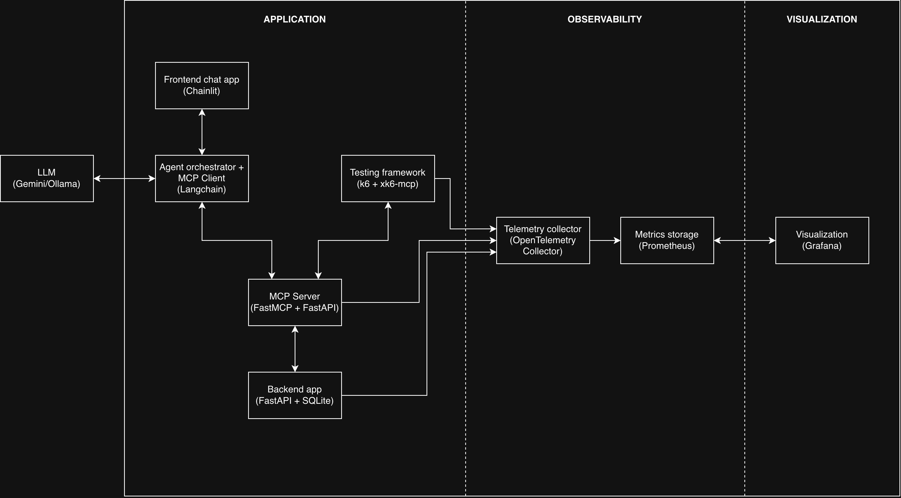

# K6 - Using K6 project for application testing

This project is part of the 'Environment of Services' course at AGH University of Krakow (summer semester, 2026).

Authors:
- Jakub Ciura ([@jciura](https://github.com/jciura)),
- Bernard Gawor ([@Gawor270](https://github.com/Gawor270)),
- Krzysztof Ligarski ([@kligarski](https://github.com/kligarski)),
- Łukasz Zegar ([@lvk4z](https://github.com/lvk4z)).

## 1. Introduction
Large language models are currently on the rise, and with that many developers seek ways to use them in everyday applications. One concept that seems the most popular right now is the 
[Model Context Protocol (MCP)](https://modelcontextprotocol.io/docs/getting-started/intro). It provides a standardized interface for connecting language models with external tools and services. LLMs, which are called in this instance AI agents, are used as middlemen between the user and the backend service. The agent interprets user's query and chooses proper tool that is available through MCP server.

As MCP servers become more widespread, it becomes increasingly important to evaluate their performance, limitations, and advantages. The main goal of this project is to design a demonstration environment that showcases xk6-mcp, a tool used for testing MCP servers. The environment will enable simulation of interactions with MCP servers and allow their behavior under load to be analyzed. Testing will be performed by collecting and visualizing metrics using [OpenTelemetry](https://opentelemetry.io/), [Prometheus](https://prometheus.io/) and [Grafana](https://grafana.com/). 

## 2. Theoretical background and technology stack
### 2.1 Application Layer

#### Chainlit
A Python framework for building interactive web applications.  
Used as the frontend interface in this project.

**Advantages:**
- Minimal amount of code required  
- Supports streaming tokens from LLMs (progressive responses)  

---

#### FastAPI
A modern, high-performance web framework for Python based on the ASGI standard. In the project, it serves two roles: the backend of the business application (REST API) and the transport layer for the MCP server (via FastMCP + SSE).

**Advantages:**
- Automatic OpenAPI documentation  
- Asynchronous execution  
- Native OpenTelemetry integration  

---

#### SQLite
A lightweight, serverless relational database. Persistence layer for the backend, stores domain data (e.g., products in inventory).

**Advantages:**
- Zero configuration, single file, suitable for demo
- Easy migration to other databases  

---

### 2.2 AI and Orchestration

#### LangChain
A framework for building applications based on LLM. Acts as the agent orchestrator and MCP client. Connects the language model with tools exposed by the MCP server.

**Features:**
- ReAct-style agents: LLM iteratively decides which tool to call based on tool descriptions from the MCP server
- Package langchain-mcp-adapters automatically converts MCP schemas into LangChain tool objects 
- Easy LLM switching (Gemini, Ollama, OpenAI)  

---

#### LLM Backends

**Google Gemini API** - cloud-based language models from Google.
- Native function/tool calling  
- Large context window  
- Access via `google-generativeai` SDK  

**Ollama** - running local LLM models. Optional backend for offline or private environments.
- No API costs, full privacy  
- Models: Llama 3, Mistral, Phi-3  
- OpenAI-compatible API  

---

#### FastMCP
Python library for building MCP servers.

**Features:**
- Define tools using `@mcp.tool()` decorator  
- Integrated with FastAPI  
- Implements MCP protocol for tool discovery and execution  

--- 

### 2.3 Testing

#### Grafana k6
An open-source tool for load and performance testing written in Go, with test scripts in JavaScript. Designed for embedding in CI/CD pipelines, natively integrates with the Grafana observability stack.

**Features:**
- Virtual users (VU) - concurrent goroutines, each independently executes a test script, easy simulation of dozens of parallel AI agents
- Built-in metrics:
  - http_req_duration
  - http_req_failed
  - iteration_duration
- Integration with OpenTelemetry and Prometheus  

---

#### xk6-mcp
A k6 extension adding native MCP client capabilities to test scripts. Allows communication with the MCP server using the full protocol instead of raw HTTP calls.

- Without xk6-mcp, JSON-RPC messages would have to be manually constructed over HTTP/SSE
- Allows validation not only of latency, but also correctness at the protocol level: whether tool schemas are valid, whether error codes are returned correctly

🔗 https://github.com/grafana/xk6-mcp  

---

### 2.4 Observability Stack

#### OpenTelemetry
A technology-neutral CNCF framework for generating, collecting, and exporting telemetry data (traces, metrics, logs). Central hub collecting data from all components.

---

#### Prometheus
An open-source toolkit for monitoring and alerting. Stores time series metrics and provides PromQL for querying.
Two ingestion modes: Remote Write (collector pushes data) or Scrape (Prometheus queries '/metrics' endpoints)

---

#### Grafana
An open-source analytics and visualization platform. Connects to Prometheus and renders configurable dashboards.
Native k6 plugin provides a ready dashboard with test results (response time distribution, number of VU, error rate)

---

### 2.5 Infrastructure – Kubernetes

A platform for container orchestration. The entire demo stack - application, MCP server, k6 operator, OTel collector, Prometheus and Grafana - is run on a Kubernetes cluster.

k6 Operator allows defining a load test as a Kubernetes manifest, tests can be triggered by CI pipeline via 'kubectl apply'

---
## 3. Demo concept description
### 3.1. Application
The application used to interact with an AI model is a simple chatbot. Its interface is implemented using [Streamlit](https://streamlit.io/), which is an open-source Python framework that allows to deliver interactive data apps in only a few lines of code.

The chatbot uses LangChain to intergrate LLM with external tools that are available through MCP server. The LLM is responsible for interpreting user's request and choosing proper tool defined in mentioned previously MCP server.

The MCP server is implemented using FastMCP and exposes a set of tools that are related to operations implemented in backend service. These operations allow user to perform actions such as retrieving product information, listing available items and calculating shipping costs.

To evaluate the behavior of the MCP server under load, testing will be performed using k6 together with xk6-mcp. The testing environment will simulate multiple AI agents sending requests to the MCP server simultaneously. This allows the system to mimic realistic interaction patterns and analyze how the MCP server performs when handling concurrent requests generated by multiple agents.
### 3.2. Observability
In order to analyze the behavior and performance of the system, the demo is equipped with an observability layer based on OpenTelemetry, which allows to collect telemtry data such as metrics, traces and logs.

To get the whole picture of the system state, K6, backend service and MCP server export telemetry data to an OpenTelemetry Collector instance. The collector then processes data and send it forward to a monitoring system based on Prometheus, which stores it.

This setup enables the collection of various performance indicators from whole system, and that allows to truly measure how MCP server behaves under different workloads, identify potential bottlenecks and assess general state of system.

### 3.3. Visualization
To make analysis of the collected telemetry data easier, the system uses Grafana for visualization. Grafana connects to Prometheus and provides interactive dashboard along with real-time metrics generated by the system.

The dashboards present key performance indicators such as request throughput, response times, error rates, and resource utilization. By analyzing these metrics, it is possible to evaluate how MCP server and backend respond to changes. 
## 4. Demo high level architecture

